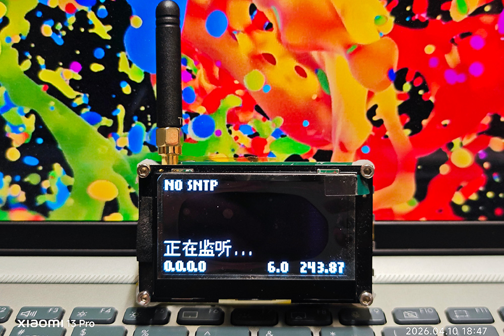
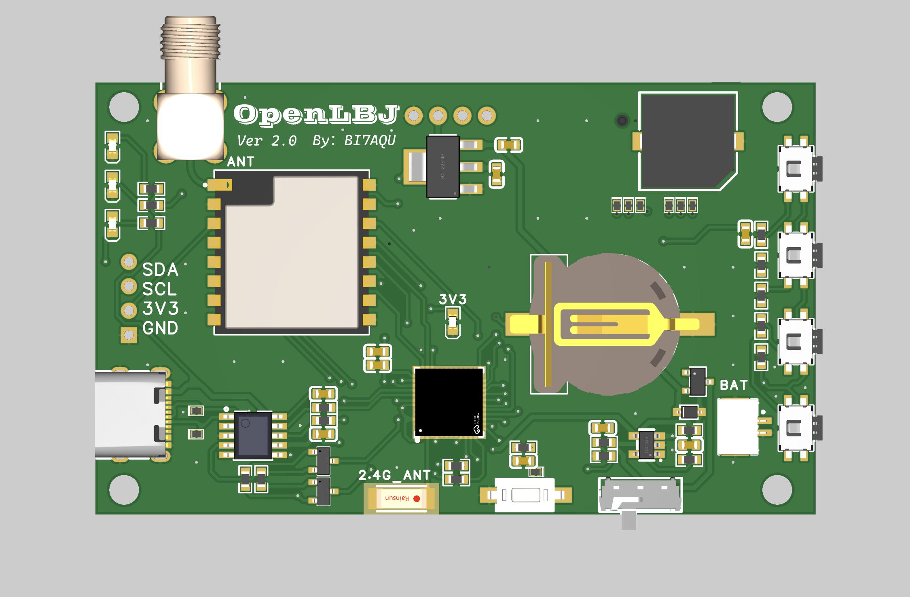
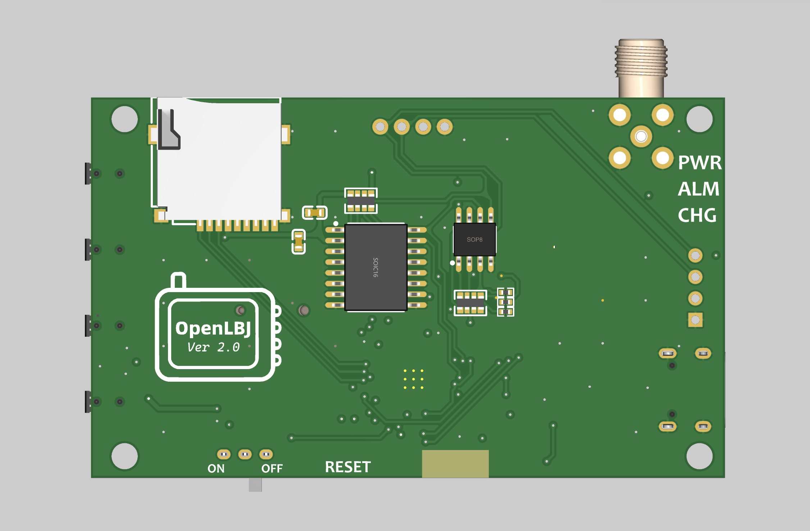
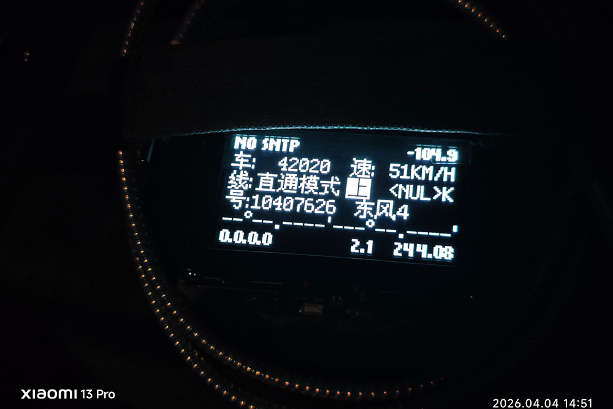

# [OpenLBJ](https://github.com/BI7AQU/OpenLBJ)
- A LBJ message receiver based on ESP32-PICO-D4 and [Ai-Thinker Ra-01H](https://docs.ai-thinker.com/en/Ra-01H/index.html) (SX1276 RF chip).
- This project aims to receive the Chinese Railway Train Proximity Alarm (on 821.2375MHz following POCSAG protocol) messages transmitted by on board LBJ systems through CIR.
- This hardware is designed to be compatible with the **[SX1276_Receive_LBJ](https://github.com/FLN1021/SX1276_Receive_LBJ)** firmware.
- The design of this project is based on the [TTGO LoRa32 ESP32 dev board](https://github.com/Xinyuan-LilyGO/LilyGo-LoRa-Series/blob/master/schematic/T3_V1.6.1.pdf), and it integrates the functions of real-time clock (RTC), button menu and buzzer alarm.

## Notice

This project is intended for learning 2FSK signal reception modulation and POCSAG code decoding.

Please ensure that this complies with local laws and regulations when in use, and assume responsibility for any risks.

## Hardware
The schematic of this board can be found in the folder.

## Known Issues
- Takes a very long time to startup if a large number of files are in TF card.
- TF card hot-plug is **NOT** supported. Unplug while power on will cause crash after next message receive.
- Partially decoded or corrupted message will show on display.

Sometimes the received messages may be corrupt, partially decoded or wrongly corrected, thus may display unreliable results.
If `<NUL>`, `NA`, `********` or part of these characters shows up, it means this part of the message is corrupted.

## License
[GPL-3.0 license](https://github.com/BI7AQU/OpenLBJ#GPL-3.0-1-ov-file)
